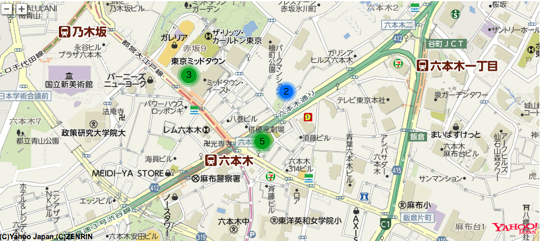

# Yahoo! Map Cluster



## Usage

```js
var ymap = new Y.Map("map");
ymap.drawMap(new Y.LatLng(35.66572, 139.73100), 15, Y.LayerSetId.NORMAL);
var marker = new Y.Marker(new Y.LatLng(35.66572, 139.73100));
var marker2 = new Y.Marker(new Y.LatLng(35.66572, 139.73000));
var marker3 = new Y.Marker(new Y.LatLng(35.665, 139.734));
var marker4 = new Y.Marker(new Y.LatLng(35.6635, 139.734));
var marker5 = new Y.Marker(new Y.LatLng(35.665, 139.731));
var marker6 = new Y.Marker(new Y.LatLng(35.6642, 139.733));
var marker7 = new Y.Marker(new Y.LatLng(35.6635, 139.7328));
var marker8 = new Y.Marker(new Y.LatLng(35.665, 139.7343));
var marker9 = new Y.Marker(new Y.LatLng(35.6638, 139.7333));
var marker10 = new Y.Marker(new Y.LatLng(35.6628, 139.7333));
new YmapCluster(ymap, [marker, marker2, marker3, marker4, marker5, marker6, marker7, marker8, marker9, marker10]);
```

## Install

### via npm

```sh
$ npm install yahoo-map-cluster --save
```

### via yarn

```sh
$ yarn add yahoo-map-cluster
```

### via cdn 

```html
<script src="https://unpkg.com/yahoo-map-cluster@latest/bundle/ymap-cluster.js"></script>
```

### Webpack/Browserify

```js
import YmapCluster from 'yahoo-map-cluster';
```
### Standalone

```html
<script src="https://unpkg.com/yahoo-map-cluster@latest/bundle/ymap-cluster.js"></script>
<script>
new YmapCluster(map, clusters, options);
</script>
```


## Reference

https://github.com/googlemaps/js-marker-clusterer